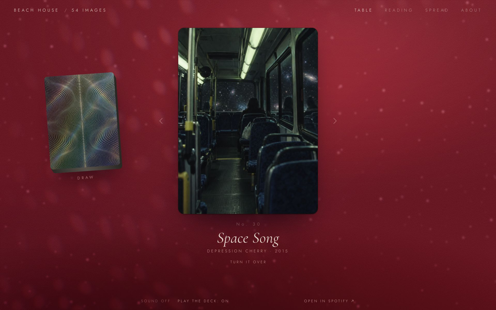
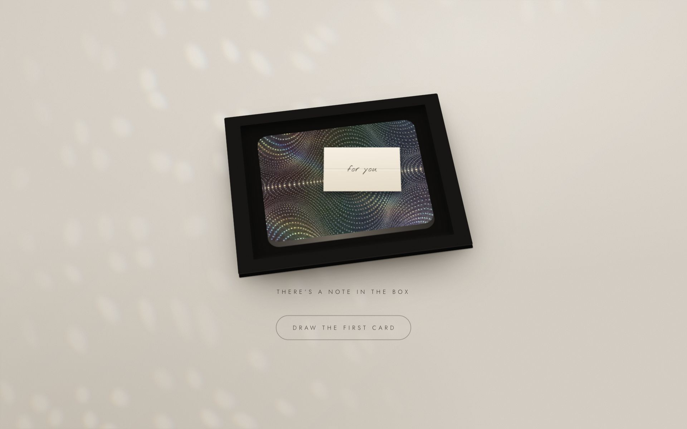
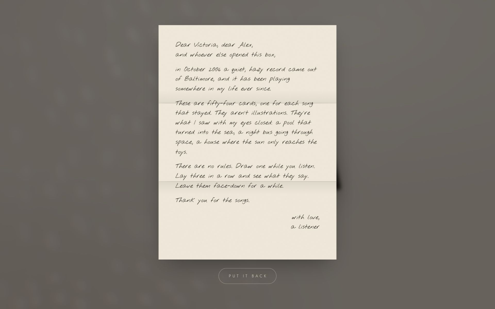
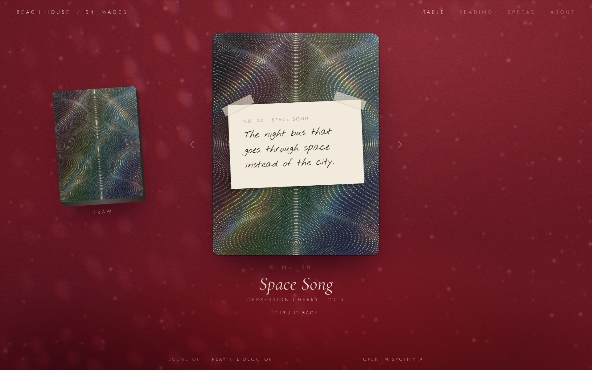
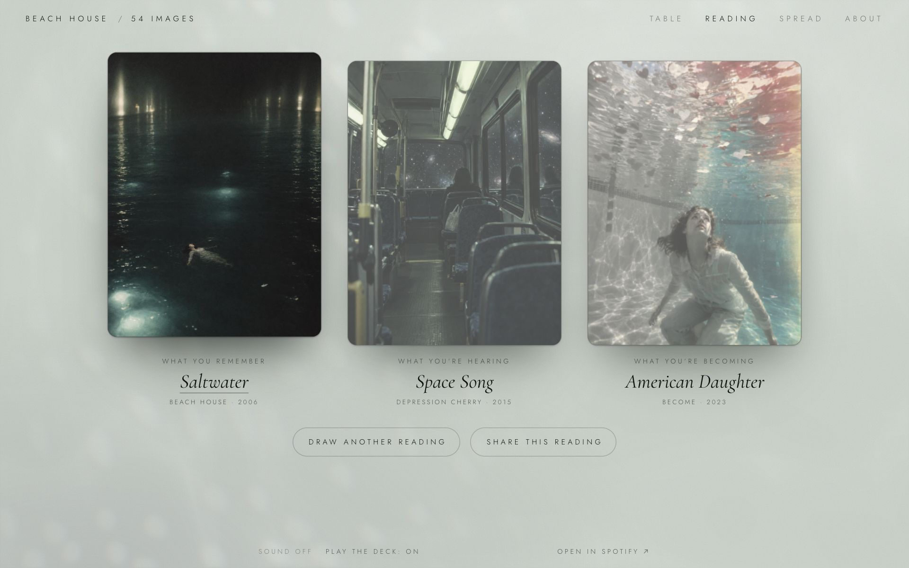
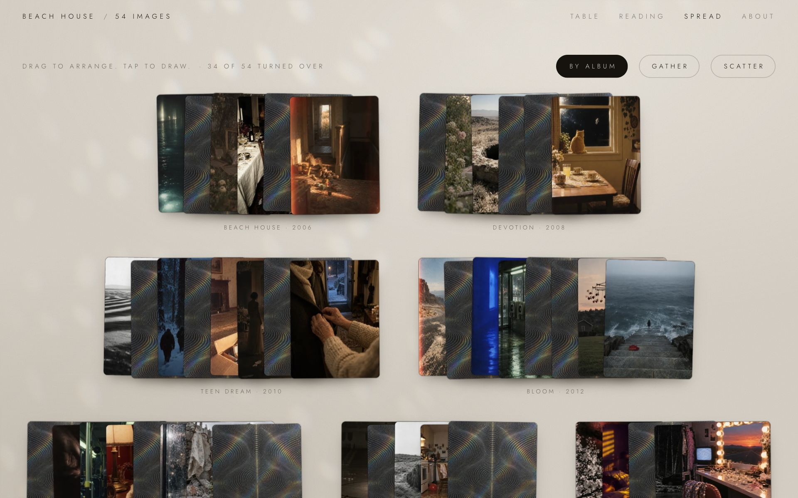
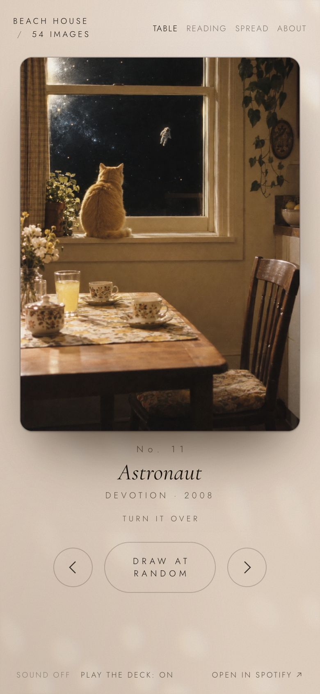

<div align="center">

# Beach House / 54 Images

**A box of 54 cards, one for each Beach House song. Draw a card and its song plays.**

An unofficial fan site for the 20th anniversary of Beach House's debut. No rules, no accounts, no build step.

### [▶ Open the box at beachhouseappreciation.vercel.app](https://beachhouseappreciation.vercel.app/)

<a href="https://beachhouseappreciation.vercel.app/"></a>

</div>

## What it is

Every card holds one image for one song: a pool that turned into the sea, a night bus going through space, a house where the sun only reaches the toys. When you draw a card it develops like a photograph, the table takes on its colours, and the song starts playing through Spotify. Turn the card over and there's a handwritten note on the back.

You can browse the deck one card at a time, lay out a three-card reading, or spread all 54 across the table and arrange them however you like. Leave it playing and it deals the next card when each song ends.

- **54 cards** across nine albums, from *Beach House* (2006) to *Become* (2023)
- **Music on every card.** Full tracks if you're signed in to Spotify in that browser, 30-second previews if not
- **A note on the back** of every card
- **Shareable readings.** The link *is* the reading
- **Works on phones.** Swipe through the deck, tap to turn a card over
- **Remembers you.** Your progress and your Spread layout are saved in your browser

## A quick guide

### 1. Open the box

Click the lid. There's a folded letter on top of the deck; click it to read it, or go straight to **Draw the first card**.

<table>
<tr>
<td width="50%"></td>
<td width="50%"></td>
</tr>
</table>

### 2. Draw a card

This is the **Table**. One card at a time, and its song plays as it lands.

- **Draw at random**: click the deck on the left, or press <kbd>D</kbd>
- **Go through in order**: the arrows beside the card, or <kbd>←</kbd> <kbd>→</kbd> (swipe on a phone)
- **Read the back**: click the card, **Turn it over**, or <kbd>Space</kbd>

<table>
<tr>
<td width="50%"></td>
<td width="50%"></td>
</tr>
</table>

### 3. Ask for a reading

Open **Reading** (or press <kbd>R</kbd>) and three cards are dealt: *what you remember*, *what you're hearing* and *what you're becoming*. Their songs play in that order. Tap a card to jump to it, tap it again to pick it up.

**Share this reading** gives you a link like `#/reading/0-30-51` (through your phone's share sheet, or copied to the clipboard), so a friend opens exactly the same three cards.



### 4. Spread them out

Open **Spread** (or press <kbd>S</kbd>) to see the whole deck on the table. Cards you haven't drawn yet lie face down, and the bar counts how many you've turned over.

- **Drag** cards anywhere. Your layout is kept for next time
- **Tap** a card to draw it
- **By album** sorts them into piles, **Gather** lines them up in rows, **Scatter** throws them across the table



### 5. Let it play

The bar along the bottom controls the music.

- **Play the deck**: when a song ends, the next card is dealt for you (a reading plays its three songs and then stops)
- **Sound on / off**: draw in silence
- **Open in Spotify**: carry on in the app

<p align="center"></p>

### Keyboard shortcuts

| Key | Does |
| --- | --- |
| <kbd>←</kbd> <kbd>→</kbd> | Previous / next card |
| <kbd>D</kbd> | Draw at random |
| <kbd>Space</kbd> | Turn the card over |
| <kbd>R</kbd> | Reading |
| <kbd>S</kbd> | Spread |

<details>
<summary><b>Small things to find</b> (spoilers)</summary>

- Turn over all 54 and a 55th card unlocks: "Irene", whose album hides one more song after a long silence (`"hidden": true` in the card data).
- *Depression Cherry* came in a red velvet sleeve, so its cards lay the table with velvet (`VELVET` in `app.js`). *Once Twice Melody* cards carry their chapter.
- The light on the table slows and dims while the music is paused. A few cards bring their own light (`MOODS` in `caustics.js`): falling stars, water, rising dust, light through blinds, a mirror ball. "Sparks" throws a spark.

</details>

## Run it yourself

Just want to use it? It's live at **[beachhouseappreciation.vercel.app](https://beachhouseappreciation.vercel.app/)**. To run your own copy: it's a static site (plain HTML, CSS and JavaScript), so there's nothing to build.

```bash
git clone https://github.com/dpappo/beach_house_appreciation.git
cd beach_house_appreciation
python3 scripts/serve.py
```

Then open http://localhost:4321. To host it, upload the folder to any static host (GitHub Pages, Netlify, Vercel…).

## Make a deck for your own band

The deck is data, so it works for any artist whose songs mean something to you.

1. **Write your cards** in `data/cards.source.json`: a title, album, year and an image prompt for each song (the array index is the card number).
2. **Generate the images.** Put `OPENAI_API_KEY=...` in `.env`, then:
   ```bash
   node --env-file=.env scripts/generate.mjs
   python3 scripts/thumbs.py
   python3 scripts/palettes.py
   ```
   Or skip generation and drop your own art in as `images/00.webp`, `images/01.webp`, …
3. **Add the music and notes** in `data/cards.json`: each card's Spotify track ID and the `note` written on its back.
4. **Rewrite the letter** in `index.html` (`#letter`) and the About text.

The Beach House touches (velvet for *Depression Cherry*, the per-card lighting in `caustics.js`, the hidden card) are keyed to card numbers, so adjust or remove them for your deck.

## How it's put together

| Path | What's there |
| --- | --- |
| `index.html`, `app.js`, `styles.css` | The whole site: views, routing (`#/card/12`, `#/reading/12-30-44`, `#/spread`), the card animations |
| `caustics.js` | The moving light on the table, drawn on a canvas |
| `data/cards.source.json` | Title, album, year and image prompt for every card |
| `data/cards.json` | What the site loads: adds Spotify track IDs, *Once Twice Melody* chapters and the `note` on each card's back |
| `data/palettes.json` | Per-card table colours, derived from each image by `scripts/palettes.py` (missing cards get `null` and keep the plain paper) |
| `data/generation-log.json` | Per-card generation record, including whether a safety note had to be appended |
| `images/NN.webp` | The cards. `images/back.webp` is the card back, `images/thumbs/` holds the Spread thumbnails |
| `docs/screenshots/` | The images in this README, captured by `scripts/screenshots.mjs` |

### Regenerating images

```bash
node --env-file=.env scripts/generate.mjs --only 12,30 --force
python3 scripts/thumbs.py
python3 scripts/palettes.py
```

Without `--force`, cards that already have an image are skipped. `palettes.py` re-reads every card (a few seconds), so rerun it whenever images change. If the model's safety filter blocks a prompt twice, the script retries with one appended line ("All figures are fully and modestly clothed…") and records that in the log.

### Keeping the screenshots current

The screenshots in this README are generated, not hand-made. `npm install` once to get Playwright and turn on the repo's git hooks; after that, any commit that changes the site (`index.html`, `app.js`, `styles.css`, `caustics.js`, card data or images) recaptures them and adds them to that commit, so what you push always matches the app. It uses your installed Chrome if you have one.

```bash
npm install
```

To refresh them by hand, run `npm run screenshots`. To skip the refresh for one commit, run `SKIP_SCREENSHOTS=1 git commit …`.

## Credits

An unofficial, non-commercial fan project, not affiliated with Beach House or Sub Pop. The songs belong to Beach House and play through Spotify's embed. The card images were generated with an AI image model from prompts written in response to each song; the song choices, notes, letter and site were made by a listener.
